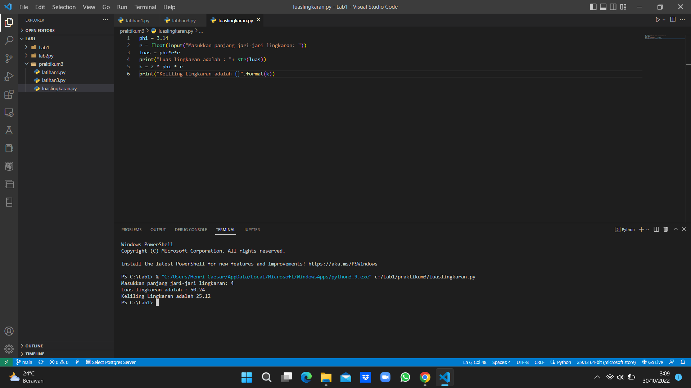
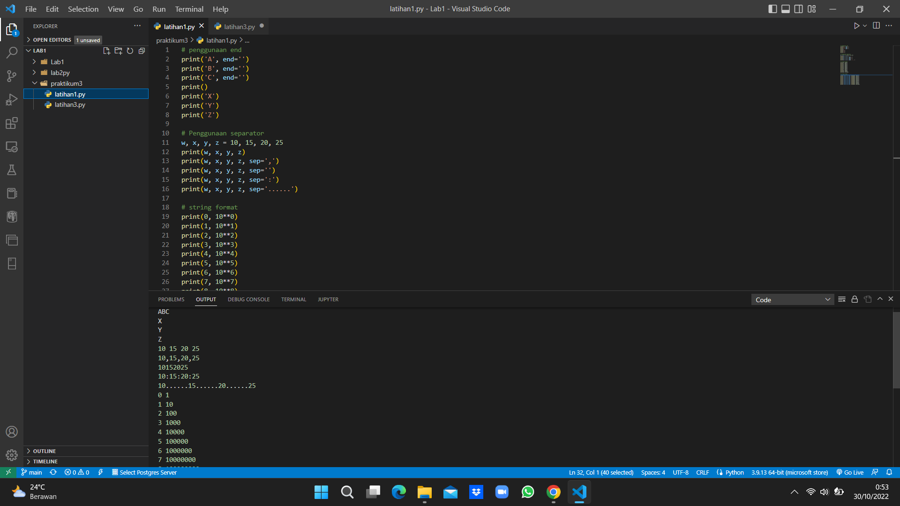
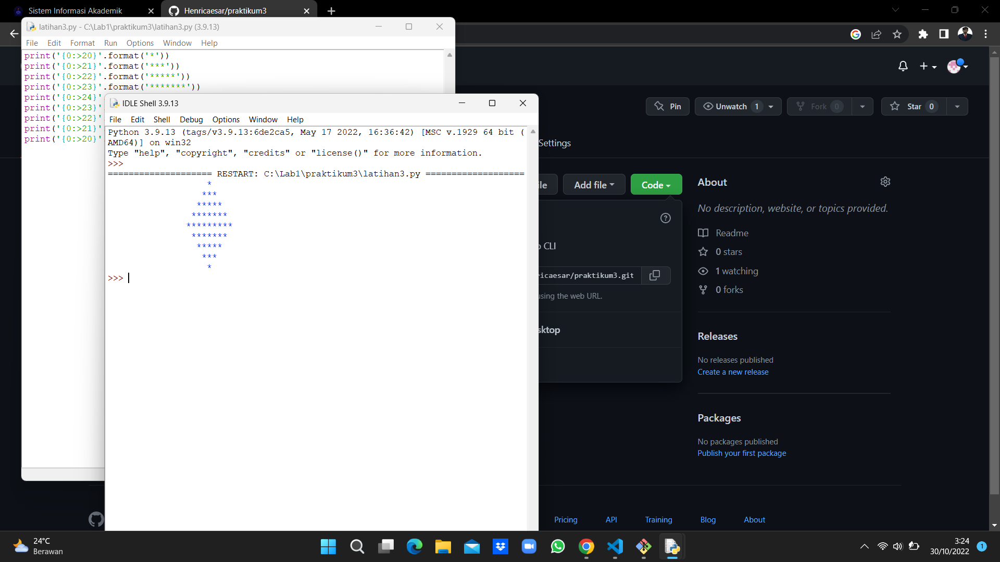

Baris 1 : mendeklarasikan variable phi dengan nilai 3.14
Baris 2 : mendeklarasikan variable r serta memasukkan nilai jari-jari lingkaran bertipe float yang didapat dari user.
Baris 3 : mendeklarasikan variable luas dimana nilai variable tersebut didapat dari perhitungan luas, dimana nilai variable phi dikali nilai variable r lalu dikali dengan variable r dan hasilnya akan dimasukkan kedalam variable luas.
Baris 4 : menampilkan nilai dari variable luas.
Baris 5 : perhitungan keliling dimana dua dikali dengan nilai variable phi dikali nilai variable r dan hasilnya akan dimasukkan kedalam variable k.
Baris 6 : menampilkan nilai dari variable k.

Screenshot Latihan 1,2,dan 3

